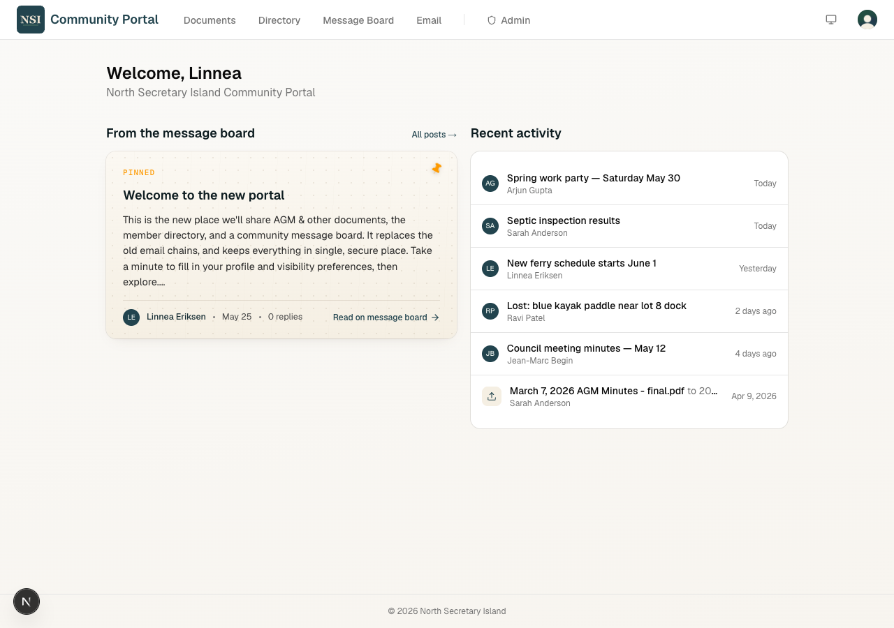
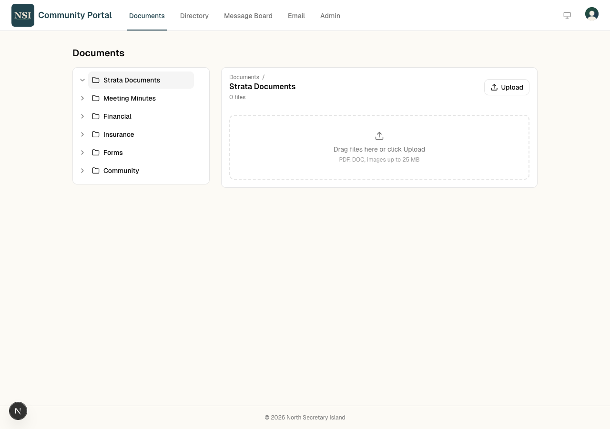
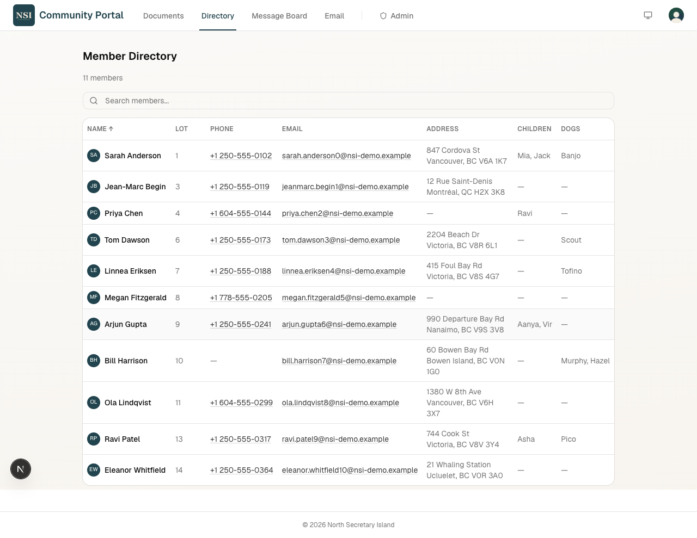
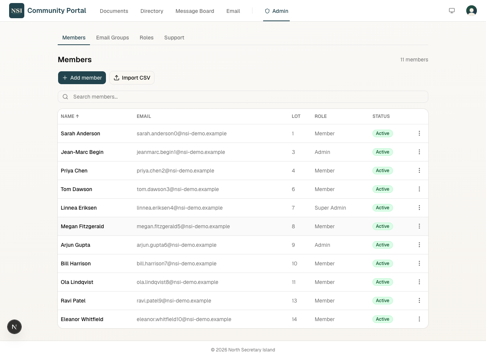

# NSI Community Portal

A members-only web portal for **North Secretary Island**, a 14-property strata
community on the BC coast (~70–112 members). Three things people actually use
it for: browsing strata documents, looking up other members, and sending group
email. Live at **[nsiportal.ca](https://nsiportal.ca)**.

## What it does

- **Document library** — folder tree, drag-and-drop upload, signed-URL
  downloads for private files (60s expiry).
- **Member directory** — searchable table with admin-defined custom fields
  (kids, dogs, etc.) and per-field visibility toggles owned by each member.
- **Community board** — posts, comments, pinned announcements.
- **Group email** — admin compose UI that sends to named groups via Resend's
  batch API, with delivery-event tracking through Resend webhooks.
- **Admin tooling** — capability-based roles, member CRUD with bulk CSV
  import, invitation lifecycle, support inbox, group + role management.

## Who it's for

Built specifically for the NSI community — not a generic product. Branding,
seed data (groups, folders, default roles), the welcome email, and the domain
are all hardcoded for this one strata. There's no theming layer or per-tenant
config; making it run for a different community would mean a real fork.

What's sized for the context is the **architecture**: ~100 stable members, a
couple of admins, low traffic, high trust. That's why DB access goes through
the service-role key with no RLS policies, why authorization lives in server
actions rather than the database, and why there's no end-user API or
multi-tenant story. Anything more would be over-built for the actual need;
the ADRs in `docs/` walk through where each line got drawn and why.

## Tech stack

| Layer | Choice |
|---|---|
| Framework | Next.js 16 (App Router, TypeScript, Tailwind v4) |
| Auth | Clerk (managed invitations, sessions, optional 2FA) |
| Database | Supabase Postgres (via PostgREST + JS client, not an ORM) |
| File storage | Supabase Storage, private bucket, signed-URL downloads |
| Email | Resend (batch send + delivery webhooks, React Email templates) |
| UI | shadcn/ui + Base UI primitives, Tailwind-styled |
| Hosting | Vercel |

## Architecture

Two services own the data, deliberately split along a clean seam:

- **Clerk owns identity** — name, email, avatar, password, sessions, 2FA. The
  app never stores passwords, and members edit name/email through Clerk's
  "Manage account" modal.
- **Supabase owns everything else** — community profile fields (phone, lot,
  custom fields), roles, capabilities, groups, documents, posts, email logs,
  file storage.

A single Clerk --> Next.js webhook bridges the two: on `user.created`
(invitation acceptance) it links the new Clerk user to a pre-seeded Supabase
profile by email, with a self-healing email-lookup fallback on next login if
the webhook ever drops. Every authenticated request re-syncs name/email/avatar
from Clerk into `app_user`, so the directory always reflects the latest
identity data without needing a second sync job.

Authorization is **capability-based**: users have roles, roles have
capabilities (`documents.write`, `email.send`, `admin.access`, etc.), and
server actions call `requireCapability()` before any mutation. RLS is enabled
on every table but no policies are defined — DB access goes through the
service-role key from trusted server code only. That trade-off (and why it's
appropriate at this scale) is documented in
[ADR-002](docs/adr-002-database-and-hosting.md).

Mutations run through **Server Actions**; API routes exist only for webhook
handlers (Clerk, Resend) and the keep-alive cron.

For the full picture — service map, data model, route map, security
walkthrough — see [`docs/nsi-portal-system-design.md`](docs/nsi-portal-system-design.md).

## Screenshots

| | |
| --- | --- |
|  |  |
| **Documents** — folder tree, drag-and-drop upload, signed-URL downloads. | **Directory** — name/lot/email search; "Children", "Dogs" are admin-defined custom fields. |
|  | |
| **Admin** — members table with status, role, CSV import, row-level actions. | |

## Documentation

- [`docs/case-study.md`](docs/case-study.md) — plain-English walkthrough of the highest-leverage decisions and trade-offs
- [`docs/nsi-portal-system-design.md`](docs/nsi-portal-system-design.md) — architecture, data model, routes, security model
- [`docs/nsi-portal-onboarding-flow-design.md`](docs/nsi-portal-onboarding-flow-design.md) — invitation state machine, error handling, UI states
- [`docs/nsi-portal-build-sequence.md`](docs/nsi-portal-build-sequence.md) — dependency-aware build order across 8 phases
- [`docs/build-log.md`](docs/build-log.md) — phase-by-phase delivery record + session notes, frozen at v1.0
- [`docs/adr-001-authentication-provider.md`](docs/adr-001-authentication-provider.md) --> [`docs/adr-005-admin-ui-approach.md`](docs/adr-005-admin-ui-approach.md) — five ADRs covering each load-bearing technical decision
- [`docs/admin-guide.md`](docs/admin-guide.md) — end-user admin reference (written for the actual non-technical admin)
- [`CLAUDE.md`](CLAUDE.md) — conventions and patterns for contributors

---

## Operations

### Supabase keep-alive cron

A Vercel Cron pings `/api/cron/keep-alive` daily at 12:00 UTC. The handler
reads one row from `app_user` so Supabase registers activity — without it,
the free-tier project auto-pauses after 7 days of idle traffic.

This is a stop-gap. Per [ADR-002](docs/adr-002-database-and-hosting.md) the
plan is still to upgrade to Supabase Pro at launch, which removes the
auto-pause behaviour entirely. The cron just buys time until then.

Daily (not every 3 days) so a couple of missed runs don't trip the 7-day
pause. We learned this the hard way once.

**Setup:**

1. Set `CRON_SECRET` in `.env.local` and in **Vercel --> Project --> Settings --> Environment Variables** (any random string, just match between the two). Vercel sends it automatically as `Authorization: Bearer ${CRON_SECRET}` to scheduled cron requests. If the var is missing on Vercel the handler still runs (and logs a warning) so the keep-alive isn't silently broken — but you should set it.
2. The `crons` entry in `vercel.json` registers the schedule on next deploy.

**Verify it's running:**

- Vercel dashboard --> project --> **Crons** tab shows last run + next run.
- Function logs should show `keep-alive ok { timestamp, rows }` after each invocation. (Hobby plan only retains ~1h of logs, so check soon after a run.)
- Locally: `curl -H "Authorization: Bearer $CRON_SECRET" http://localhost:3000/api/cron/keep-alive` — expect `{ ok: true, ... }`. Without the header it should 401 (assuming `CRON_SECRET` is set locally).
