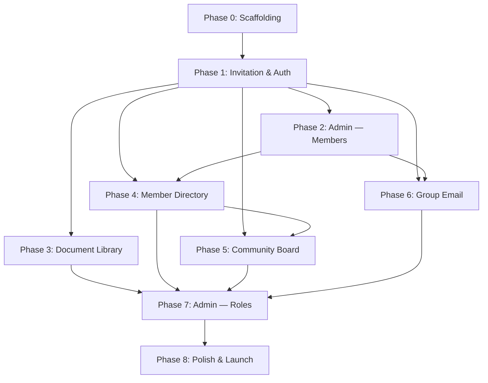

# NSI Community Portal — Build Sequence

**Date:** 2026-04-04
**Author:** Spencer Campbell
**Status:** Pre-build

> **Not a sprint plan.** This is a dependency-aware sequence of buildable increments, each with a clear definition of "done." No time estimates — Spencer is volunteering on a flexible schedule. The order is driven by technical dependencies, not business priority.

---

## Phase 0: Project Scaffolding

**What:** Set up the development environment, project structure, and service accounts.

**Tasks:**
- Initialize Next.js project with App Router, TypeScript, Tailwind CSS
- Create Clerk development instance; configure `clerkMiddleware()` with public/protected route matchers
- Create Supabase project (free tier); run initial schema migration (User, Role, RoleCapability tables)
- Create Resend account; verify sending domain with SPF/DKIM/DMARC
- Configure Vercel project with GitHub integration; set environment variables for all three services
- Set up `(auth)` and `(portal)` route groups with basic layout shells
- Confirm end-to-end: a request to a protected route redirects to `/sign-in`, Clerk session works, Supabase client can query

**Done when:** A developer can clone the repo, set environment variables, and run the app locally. Protected routes redirect to sign-in. Clerk session verification works. Supabase connection is live.

**Depends on:** Nothing — this is the foundation.

---

## Phase 1: Invitation & Authentication

**What:** Build the full invitation-to-login flow described in the Onboarding Flow Design document. This is the highest-risk feature and the depth piece.

**Tasks:**
- `/sign-in` page with themed `<SignIn />` component
- `/sign-up` page with `__clerk_ticket` handling and error states (expired, revoked, no ticket, already used)
- Webhook endpoint: `POST /api/webhooks/clerk` — match Clerk user to Supabase profile by email, set `clerk_id` and `accepted_at`
- Self-healing fallback: if `clerk_id` not found on login, fall back to email lookup and link
- Portal layout: fetch current user's Supabase profile and capabilities, provide via context
- Middleware: check `active` flag on user profile; redirect deactivated users
- Password reset flow (Clerk-managed, themed to match portal)

**Done when:** Spencer can create a User record in Supabase Studio, call `createInvitation()` from a test script, receive the email, click the link, set a password, and land on the portal dashboard as an authenticated user with the correct role and capabilities loaded.

**Depends on:** Phase 0.

---

## Phase 2: Admin — Member Management

**What:** Build the admin UI for inviting and managing members. This is the admin-facing counterpart to Phase 1's member-facing flow.

**Tasks:**
- `/admin` layout with `admin.access` capability gate
- `/admin/members` page: members table with status badges, search, sort
- Add Member form: individual invitation with profile pre-seeding
- Row actions: send invitation, resend, revoke, edit, deactivate/reactivate
- Bulk import: CSV upload, validation preview, batch profile creation, batch invitation sending with rate limit handling
- Status tracking: Draft → Invited → Active → Revoked → Inactive badges and transitions

**Done when:** Allison (or Spencer acting as Allison) can add a member, send an invitation, see the member appear as "Invited," watch it transition to "Active" when the member accepts, and resend/revoke invitations for members who haven't accepted.

**Depends on:** Phase 1 (invitation flow must work end-to-end before the admin UI wraps it).

---

## Phase 3: Document Library

**What:** Build the browsable document library — the primary use case for the portal.

**Tasks:**
- Database migration: Folder and Document tables
- Supabase Storage: create private `documents` bucket with RLS policies
- `/documents` page: folder tree view with expand/collapse
- `/documents/:slug` page: file listing within a folder
- Document download: server-side signed URL generation, time-limited
- Admin inline controls (capability-gated): upload button, drag-and-drop upload, folder creation, file/folder rename, file deletion
- Seed data: create the folder hierarchy from the design spec (Strata Resources, Other Resources, subcategories)

**Done when:** An admin can create folders, upload documents, and organize them. A member can browse the folder tree, expand folders, and download files. Non-authenticated users cannot access files or folders.

**Depends on:** Phase 1 (auth must work; need real users with capabilities to test admin vs. member views).

---

## Phase 4: Member Directory

**What:** Build the searchable member directory.

**Tasks:**
- `/directory` page: table/list view of all active members
- Search: filter by name, lot number, email
- Custom fields system: database migration for CustomField and CustomFieldValue tables; seed "Kids" and "Dogs" as initial fields
- `/profile` page: edit own profile, custom field values, directory visibility toggles (opt-in per field)
- Admin: `/admin/members` edit form updated to include custom fields
- Directory renders custom fields dynamically based on CustomField definitions

**Done when:** Members can view the directory, search for other members, edit their own profile (including custom fields), and toggle visibility of optional fields. The directory shows all active members with their shared information.

**Depends on:** Phase 1 (need user records), Phase 2 (member management UI provides the member data).

---

## Phase 5: Community Board

**What:** Build the community board for posts and comments.

**Tasks:**
- Database migration: Post and Comment tables
- `/community` page: post feed (reverse chronological, pinned posts first)
- `/community/:id` page: single post with comments thread
- Create post form (any member with `community.write`)
- Create comment form
- Admin/moderator controls: pin/unpin, delete others' posts (capability-gated)
- Notification emails: when a new post is created, email members with `notify_new_post = true` (via Resend)
- Notification preferences: toggles on `/profile` page for `notify_new_post` and `notify_replies`

**Done when:** Members can create posts, comment on posts, and receive email notifications for new posts. Admins can pin and delete posts. Members can opt out of notifications.

**Depends on:** Phase 1 (auth), Phase 4 (profile page exists for notification preferences).

---

## Phase 6: Group Email

**What:** Build the group email compose and send feature — the third core MVP pillar.

**Tasks:**
- Database migration: Group, UserGroup, EmailLog tables
- Admin: `/admin/groups` page — group CRUD, member assignment
- Group membership management from both directions (member record and group detail page)
- `/email/compose` page (capability-gated: `email.send`): group selector, subject, rich text body, recipient count preview, confirmation dialog before send
- Send flow: resolve group membership → render React Email template → send via Resend batch API → create EmailLog record
- `/email/history` page: sent email log with subject, date, sender, recipient count, delivery status
- Resend webhook handler: `POST /api/webhooks/resend` — log delivery events against EmailLog records
- React Email templates: group broadcast template with portal branding

**Done when:** Allison can compose an email, select "Work Party" as the target group, see "23 members" as the recipient count, confirm, and send. The email arrives in members' inboxes. The sent email appears in the history log with delivery status.

**Depends on:** Phase 1 (auth), Phase 2 (member management — need members assigned to groups).

---

## Phase 7: Admin — Roles & Permissions

**What:** Build the admin-configurable role and capability management UI.

**Tasks:**
- `/admin/roles` page: role list with capability summary
- Role detail/edit: capability checkbox grid
- Create new role, delete role (with safeguard: can't delete a role that has members assigned)
- Role assignment: dropdown on member edit form
- Validate that capability checks work end-to-end: create a test role with limited capabilities, assign to a user, verify they can/can't access gated features

**Done when:** Allison can create a new role, assign capabilities to it, assign the role to a member, and that member sees only the features their role permits. Role changes take effect immediately.

**Depends on:** Phases 1–6 (all capability-gated features must exist before the role editor is meaningful to test).

---

## Phase 8: Polish & Launch Prep

**What:** Final pass on responsiveness, error handling, edge cases, and launch logistics.

**Tasks:**
- Responsive design audit: test all pages at mobile (375px), tablet (768px), desktop (1440px)
- Error state audit: verify every error case in the onboarding flow design doc renders correctly
- Loading states: skeleton loaders or spinners for all async operations
- First-login welcome experience (dismissible banner, profile completion prompt)
- Empty states: meaningful messages for empty folders, empty directory, no posts
- Accessibility pass: keyboard navigation, focus management, color contrast
- Supabase upgrade: switch to Pro plan before inviting real members
- Domain setup: purchase domain, configure DNS, point to Vercel, configure Resend sending domain
- Seed production data: create folder structure, upload initial documents
- Welcome email template (React Email): sent after member completes onboarding
- Documentation: admin guide for Allison (how to invite members, upload documents, send emails)

**Done when:** Spencer and Allison walk through every feature on mobile and desktop. Allison can independently add a member, upload a document, and send a group email without Spencer's help. The portal is ready for community launch.

**Depends on:** All previous phases.

---

## Dependency Graph

**Critical path:** Phase 0 → Phase 1 → Phase 2 → Phase 6 (or Phase 3). Phases 3, 4, 5, and 6 can be built in any order after Phase 2, though the sequence above follows the natural dependency chain.

---

## Notes

- **Phases 3–6 are parallelizable in theory** but will be built sequentially since this is a solo developer project. The order above reflects the most logical flow: documents (primary use case) → directory (depends on user data) → community board (lower priority) → email (depends on groups).
- **Phase 7 (Roles) is deliberately late.** The seed roles (Admin, Council, Member) are sufficient for all development and testing. The admin UI for role configuration is a refinement, not a blocker.
- **Admin tooling is distributed, not centralized.** Admin features are built alongside the features they administrate (e.g., document upload is built in Phase 3, not in a separate "admin phase"). Phase 2 and Phase 7 are the exceptions — member management and role management don't have a natural home in member-facing features.
- **No time estimates.** The build pace depends on Spencer's availability. The sequence ensures that at any stopping point, the most valuable features are already built.
