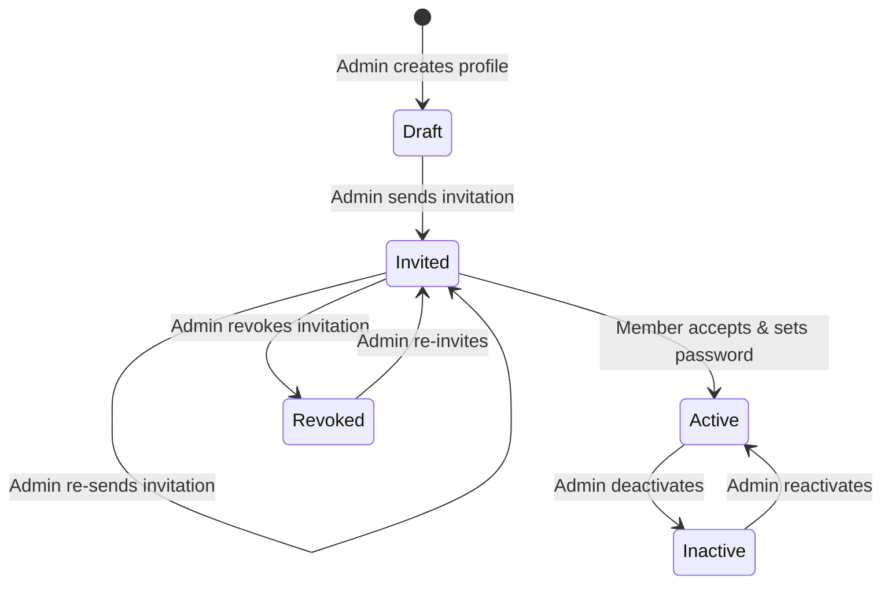
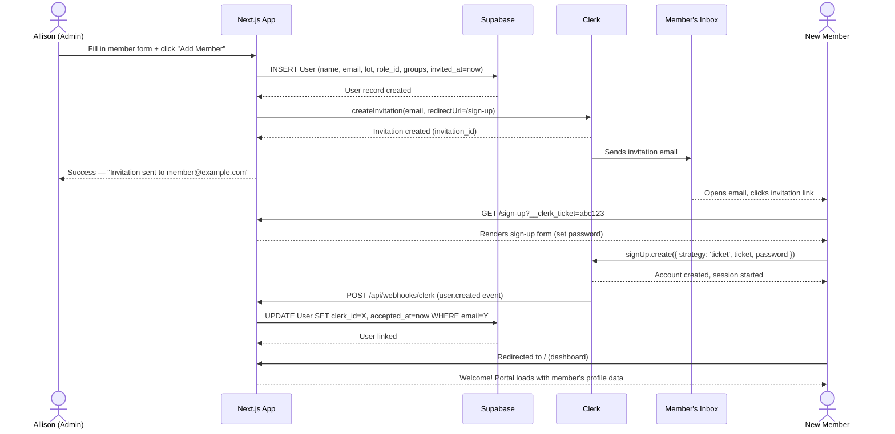
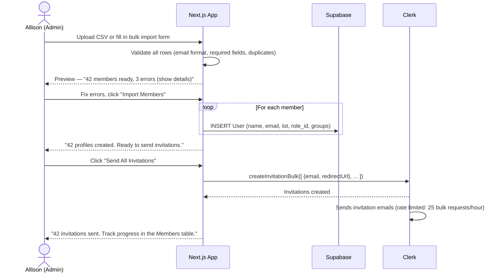
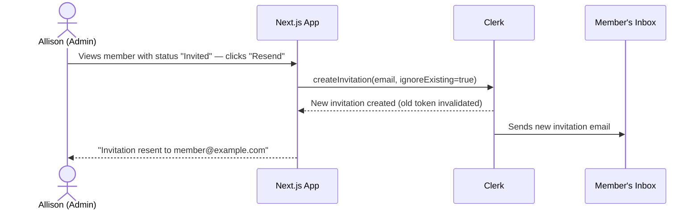

# NSI Community Portal — Invitation & Onboarding Flow Design

**Date:** 2026-04-04
**Author:** Spencer Campbell
**Status:** Pre-build

> **Why this document exists:** The invitation flow is the single highest-risk feature in the portal. It's the first interaction every member has with the system, and it's the feature that failed on every platform evaluated during the 3-month evaluation phase. This document goes deep on the states, transitions, error handling, and UI for the full lifecycle from admin invitation to active member.

---

## 1. Member Lifecycle State Machine

Every member in the system is in exactly one of five states:



### State Definitions

| State | `invited_at` | `accepted_at` | `clerk_id` | `active` | Description |
|-------|-------------|---------------|------------|----------|-------------|
| **Draft** | null | null | null | true | Profile created in Supabase but invitation not yet sent. Used during bulk import when admin wants to pre-populate profiles before sending invitations. |
| **Invited** | set | null | null | true | Invitation email sent via Clerk. Member has not yet clicked the link and set their password. |
| **Active** | set | set | set | true | Member has accepted the invitation, set their password, and can log in. |
| **Revoked** | set | null | null | true | Invitation was revoked by admin. The Clerk invitation token is invalidated. Member cannot use the original link. |
| **Inactive** | set | set | set | false | Account deactivated by admin. Member cannot log in. Profile data is retained. |

### State Transitions

| Transition | Trigger | What Happens |
|-----------|---------|-------------|
| Draft → Invited | Admin clicks "Send Invitation" | `clerkClient.invitations.createInvitation()` called; `invited_at` set |
| Invited → Invited | Admin clicks "Resend" | New `createInvitation()` call with `ignoreExisting: true`; original token invalidated |
| Invited → Active | Member completes sign-up | Clerk `user.created` webhook fires; handler sets `clerk_id` and `accepted_at` |
| Invited → Revoked | Admin clicks "Revoke" | `clerkClient.invitations.revokeInvitation()` called; token invalidated |
| Revoked → Invited | Admin clicks "Re-invite" | New `createInvitation()` call; `invited_at` updated |
| Active → Inactive | Admin toggles "Active" off | `active` set to false; Clerk session is not affected (member is signed out on next request via middleware check) |
| Inactive → Active | Admin toggles "Active" on | `active` set to true; member can log in again |

---

## 2. Sequence Diagrams

### 2.1 Individual Invitation (Happy Path)



### 2.2 Bulk Invitation (Initial Community Onboarding)



### 2.3 Re-invitation (Member Never Accepted)



---

## 3. Error Handling Matrix

### 3.1 Invitation Errors (Admin Side)

| Error | Cause | Detection | User-Facing Message | Recovery |
|-------|-------|-----------|-------------------|----------|
| **Duplicate email** | Email already exists in Supabase User table | Pre-insert check | "A member with this email already exists." | Show link to existing member's profile |
| **Invalid email format** | Malformed email address | Client-side validation | "Please enter a valid email address." | Inline form validation |
| **Clerk invitation fails** | Clerk API error (rate limit, service outage) | API response error | "Invitation could not be sent. Please try again." | Retry button; profile is already created in Draft state |
| **Clerk rate limit** | More than 100 invitations/hour | 429 response from Clerk | "Too many invitations sent. Please wait and try again in [time]." | Show rate limit countdown; queue remaining invitations |
| **Bulk import — partial failure** | Some rows fail validation, others succeed | Row-by-row validation | "38 of 42 members imported. 4 errors (details below)." | Show error details per row; allow fixing and retrying failed rows |
| **Profile created but invitation not sent** | Clerk call fails after Supabase insert succeeds | Clerk API error | "Member profile created but invitation could not be sent." | Member shows in Draft state; admin can retry sending invitation |

### 3.2 Acceptance Errors (Member Side)

| Error | Cause | Detection | User-Facing Message | Recovery |
|-------|-------|-----------|-------------------|----------|
| **Expired invitation link** | Token has expired (Clerk default: 30 days) | Clerk rejects ticket | "This invitation link has expired. Please contact your community administrator for a new one." | Admin resends invitation from the Members table |
| **Revoked invitation link** | Admin revoked the invitation | Clerk rejects ticket | "This invitation is no longer valid. Please contact your community administrator." | Admin can re-invite if appropriate |
| **Already used link** | Member clicks link after already completing sign-up | Clerk rejects ticket or user already exists | "You've already set up your account. Please sign in instead." | Link to /sign-in |
| **No ticket parameter** | Direct navigation to /sign-up without an invitation | Missing `__clerk_ticket` | "This portal is invite-only. If you're a community member, please check your email for an invitation or contact your administrator." | No self-registration path; display contact info for Allison |
| **Password too weak** | Password doesn't meet Clerk's requirements | Clerk validation | "Password must be at least 8 characters." | Inline form feedback |
| **Network error during sign-up** | Connection lost during account creation | Fetch failure | "Something went wrong. Please check your connection and try again." | Retry button; idempotent operation |

### 3.3 Webhook Errors (System)

| Error | Cause | Detection | Impact | Recovery |
|-------|-------|-----------|--------|----------|
| **Webhook delivery failure** | Vercel endpoint unreachable | Clerk retry policy (automatic) | Member is authenticated in Clerk but `clerk_id` not set in Supabase; member can log in but app may not find their profile | Clerk retries webhooks automatically; fallback: app checks Clerk on login if no clerk_id found |
| **Email match failure** | Clerk user email doesn't match any Supabase User record | Webhook handler lookup returns null | Orphaned Clerk user with no Supabase profile | Log error; admin manually links accounts via Supabase Studio; investigate why the pre-seeded profile is missing |
| **Duplicate webhook** | Clerk sends the same event twice | Idempotency check on `clerk_id` | No impact if handler is idempotent | Handler checks if `clerk_id` is already set before updating |

---

## 4. UI State Inventory

### 4.1 Admin: Add Member Form

**Route:** `/admin/members` → "Add Member" button → modal or slide-out panel

**Fields:**
- First Name (required)
- Last Name (required)
- Email (required, validated)
- Phone (optional)
- Lot Number (optional)
- Role (dropdown, defaults to the role with `is_default = true`)
- Groups (multi-select checkboxes)
- Send invitation immediately (checkbox, default: checked)

**States:**

| State | UI |
|-------|-----|
| **Empty form** | All fields blank, "Add Member" button disabled until required fields are filled |
| **Validating** | Inline validation as user types: email format check, required field indicators |
| **Submitting** | "Add Member" button shows spinner, form fields disabled |
| **Success (with invitation)** | Toast: "Member added and invitation sent to name@example.com" — form resets, member appears in table with "Invited" badge |
| **Success (without invitation)** | Toast: "Member added. Invitation not yet sent." — member appears with "Draft" badge |
| **Error: duplicate email** | Inline error below email field: "A member with this email already exists." — link to existing profile |
| **Error: Clerk API failure** | Toast (error): "Profile created but invitation could not be sent. You can retry from the members table." — member appears with "Draft" badge |
| **Error: network failure** | Toast (error): "Something went wrong. Please try again." — form stays populated for retry |

### 4.2 Admin: Members Table

**Route:** `/admin/members`

**Columns:** Name, Email, Lot, Role (badge), Groups (chips), Status (badge), Last Login

**Status badges:**

| Badge | Color | Meaning |
|-------|-------|---------|
| Draft | Gray | Profile created, invitation not sent |
| Invited | Yellow/Amber | Invitation sent, awaiting acceptance |
| Active | Green | Member has logged in |
| Revoked | Red | Invitation was revoked |
| Inactive | Gray, strikethrough | Account deactivated |

**Row actions (kebab menu or hover):**
- **Draft:** Send Invitation, Edit, Delete
- **Invited:** Resend Invitation, Revoke Invitation, Edit, Delete
- **Active:** Edit, Deactivate
- **Revoked:** Re-invite, Edit, Delete
- **Inactive:** Reactivate, Delete

**Bulk actions (checkbox selection):**
- Send Invitations (for Draft members)
- Resend Invitations (for Invited members)

### 4.3 Admin: Bulk Import

**Route:** `/admin/members` → "Import Members" button → dedicated page or large modal

**Step 1: Upload**
- CSV file upload area (drag-and-drop or file picker)
- Template download link: "Download CSV template"
- Expected columns: first_name, last_name, email, phone, lot_number, groups (comma-separated slugs)

**Step 2: Preview & Validate**

| State | UI |
|-------|-----|
| **Parsing** | Spinner: "Reading file..." |
| **Validation complete — all valid** | Table showing all rows with green checkmarks. "42 members ready to import." |
| **Validation complete — some errors** | Table with valid rows (green) and error rows (red highlight + error message in last column). "38 valid, 4 errors." Error messages: "Invalid email format", "Duplicate email — already exists", "Missing required field: last_name" |
| **Validation complete — all errors** | Error state: "No valid rows found. Please check your CSV format." Link to template. |

**Step 3: Import**

| State | UI |
|-------|-----|
| **Importing** | Progress bar: "Creating profiles... 23 of 42" |
| **Import complete** | Success: "42 member profiles created." Toggle: "Send invitations now?" with confirmation button |
| **Sending invitations** | Progress: "Sending invitations... 23 of 42" (may take time due to Clerk rate limits) |
| **Complete** | "42 members imported and invited. Track their status in the Members table." |
| **Partial failure** | "38 invitations sent. 4 failed (details below). You can retry failed invitations from the Members table." |

### 4.4 Member: Invitation Email

**From:** `NSI Community Portal <portal@nsi-portal.ca>` (or similar)
**Subject:** "You're invited to the NSI Community Portal"

**Body (React Email template):**
```
Hi [First Name],

You've been invited to join the North Secretary Island Community Portal 
— a private site for NSI members to access community documents, look 
up contact information, and stay connected.

[Set Up Your Account]  ← primary CTA button linking to /sign-up?__clerk_ticket=...

This link will expire in 30 days. If you have any trouble, 
contact Allison at [allison's email].

— NSI Community Portal
```

**Design notes:**
- Single primary CTA button — no secondary actions or links that could distract
- Plain, minimal design — no heavy branding or images that might trigger spam filters
- Sender name includes "NSI" so members recognize it
- Expiration note sets expectations
- Allison's email as fallback contact

### 4.5 Member: Sign-Up Page (Invitation Acceptance)

**Route:** `/sign-up?__clerk_ticket=abc123`

**States:**

| State | UI |
|-------|-----|
| **Loading** | Centered spinner while Clerk validates the ticket |
| **Valid ticket** | Sign-up form: password field, confirm password field, "Create Account" button. Header: "Welcome to the NSI Community Portal". Subheader: "Set a password to activate your account." Email displayed but not editable (pre-filled from invitation). |
| **Submitting** | "Create Account" button shows spinner, fields disabled |
| **Success** | Redirect to `/` (dashboard). Brief flash: "Account created!" |
| **Expired ticket** | Error state: "This invitation link has expired." Body: "Please contact your community administrator for a new invitation." Contact info for Allison. No form displayed. |
| **Revoked ticket** | Error state: "This invitation is no longer valid." Same recovery path as expired. |
| **Already used** | "You've already set up your account." Link: "Sign in instead →" pointing to `/sign-in` |
| **No ticket** | "This portal is invite-only." Body: "If you're a community member, check your email for an invitation or contact your administrator." Contact info. No form displayed. |
| **Password validation error** | Inline error below password field. Form stays populated. |
| **Network error** | Toast: "Something went wrong. Please check your connection and try again." Retry button. |

### 4.6 Member: First Login (Post-Acceptance)

After setting their password and being redirected to the dashboard, the member sees:

**Dashboard (first visit):**
- Welcome banner: "Welcome to the NSI Community Portal, [First Name]!" with a brief orientation: "Here you can browse community documents, look up member contact info, and stay connected with the community."
- Quick links: Documents, Directory, Community Board
- Pinned posts (if any exist)
- Dismissible — once dismissed, doesn't show again (stored in localStorage or a user preference)

**Profile prompt (optional):**
- If custom fields (Kids, Dogs) are empty, a subtle prompt on the dashboard: "Complete your profile — add info like kids' names or pets so other members can find you in the directory." Links to `/profile`.
- Non-blocking — the member can use the portal fully without completing their profile.

### 4.7 Member: Sign-In Page

**Route:** `/sign-in`

**States:**

| State | UI |
|-------|-----|
| **Default** | Email and password fields. "Sign In" button. "Forgot password?" link. No "Sign up" link (invite-only portal). |
| **Submitting** | Button shows spinner, fields disabled |
| **Success** | Redirect to `/` (dashboard) |
| **Invalid credentials** | Inline error: "Invalid email or password." Fields stay populated. |
| **Account inactive** | Error: "Your account has been deactivated. Please contact your administrator." |
| **Network error** | Toast: "Something went wrong. Please try again." |

### 4.8 Member: Password Reset

**Route:** `/sign-in` → "Forgot password?" link

**Flow:**
1. Enter email → Clerk sends password reset email
2. Click link in email → lands on Clerk-hosted or embedded reset page
3. Set new password → redirect to `/sign-in`

**States:**

| State | UI |
|-------|-----|
| **Enter email** | Email field + "Send Reset Link" button |
| **Submitting** | Spinner on button |
| **Email sent** | "Check your email for a password reset link. If you don't see it, check your spam folder." |
| **Email not found** | Same success message (don't reveal whether email exists in system) |
| **Reset form** | New password + confirm password fields |
| **Reset complete** | "Password updated. Sign in with your new password." Link to `/sign-in`. |

---

## 5. Edge Cases & Recovery Paths

### Member changes email address

If a member needs to change their email (e.g., switching from Shaw to Gmail), this must be coordinated between Clerk and Supabase:
- Clerk: email is updated via the Clerk dashboard or `<UserProfile />` component
- Supabase: `User.email` must be updated to match
- A webhook (`user.updated`) can automate this sync, or it can be handled manually by Spencer via Supabase Studio for the rare case where it happens

### Member loses access to their email

If a member can no longer access the email address they registered with (e.g., Shaw account closed), Spencer would need to:
1. Update the member's email in Clerk (via dashboard)
2. Update the member's email in Supabase
3. Trigger a password reset to the new email

This is a rare, manual process for a community of this size.

### Invitation sent to wrong email

Admin can revoke the invitation from the Members table, then either delete the profile or update the email and re-invite. If the wrong recipient has already accepted, Spencer would need to delete the Clerk user and Supabase profile, then re-create and re-invite with the correct email.

### Multiple members sharing an email address

Some older couples may share a single email address. The system requires unique emails per user. Options:
- Create one account for the household, with both names in the profile
- Use email aliases (e.g., `shared+john@example.com` and `shared+jane@example.com`) if their provider supports the `+` alias convention
- This should be flagged to Allison as a known constraint during initial member data collection

### Clerk webhook is down during sign-up

If the webhook handler is unreachable when a member accepts their invitation:
- The member's Clerk account is created and they're logged in
- The Supabase profile is not linked (`clerk_id` remains null, `accepted_at` remains null)
- On next login, the middleware looks up the Supabase profile by Clerk user ID; if not found, it falls back to email lookup. If found by email, it sets `clerk_id` at that point (self-healing)
- This fallback ensures the member is never stuck in a broken state

---

## 6. Rate Limits & Constraints

| Constraint | Limit | Impact on NSI |
|-----------|-------|---------------|
| Clerk `createInvitation` | 100 requests/hour per instance | Individual invites: no impact. Bulk: may need to batch across multiple hours for 70+ members |
| Clerk `createInvitationBulk` | 25 requests/hour per instance | Each request can contain multiple invitations. 70 members in 3 requests is well within limits |
| Clerk invitation expiry | 30 days (default, configurable) | Adequate for NSI. Members who haven't accepted after 30 days get a reminder from Allison, then a re-invite |
| Resend daily API cap (free tier) | 100 requests/day | Not relevant to invitations (Clerk sends those). Relevant to group emails and notifications only |

### Bulk Onboarding Timeline

For the initial community launch (~70 members):

1. **Day 1:** Allison imports all member profiles via CSV (creates Draft records)
2. **Day 1:** Allison reviews and sends invitations (Clerk bulk API, ~3 API calls)
3. **Day 1–7:** Members receive emails and accept at their own pace
4. **Day 7:** Allison checks the Members table for members still in "Invited" status
5. **Day 7–14:** Allison contacts stragglers directly (phone/text) and offers to help them through the process
6. **Day 14:** Allison resends invitations to anyone who hasn't accepted
7. **Day 30:** Invitations expire. Allison re-invites remaining holdouts as needed

This timeline accounts for the reality that some 1st gen members will need personal assistance from Allison to complete the sign-up process.

---

## 7. Implementation Checklist

### Phase 1: Core Invitation Flow
- [ ] Clerk project setup (dev instance)
- [ ] `clerkMiddleware()` configuration with public/protected route matchers
- [ ] `/sign-in` page with themed `<SignIn />` component
- [ ] `/sign-up` page with invitation ticket handling
- [ ] Webhook endpoint: `POST /api/webhooks/clerk`
- [ ] Webhook handler: match Clerk user to Supabase profile by email, link accounts
- [ ] Self-healing fallback: email-based lookup if `clerk_id` not found on login

### Phase 2: Admin Invitation UI
- [ ] Add Member form (individual invitation)
- [ ] Members table with status badges and row actions
- [ ] Send/resend/revoke invitation actions
- [ ] Invitation status tracking (Draft, Invited, Active, Revoked, Inactive)

### Phase 3: Bulk Import
- [ ] CSV template generation and download
- [ ] CSV parsing and validation with error reporting
- [ ] Bulk profile creation with progress indicator
- [ ] Bulk invitation sending with rate limit handling
- [ ] Partial failure handling and retry UI

### Phase 4: Edge Cases & Polish
- [ ] Expired/revoked/no-ticket error states on sign-up page
- [ ] Account deactivation flow (admin toggle + middleware enforcement)
- [ ] First-login welcome experience
- [ ] Password reset flow
- [ ] Profile completion prompt

### Phase 5: Email Templates
- [ ] Invitation email (React Email)
- [ ] Welcome email (sent after acceptance, separate from Clerk's invitation)
- [ ] Password reset email (Clerk-managed, but branding can be customized in dashboard)
