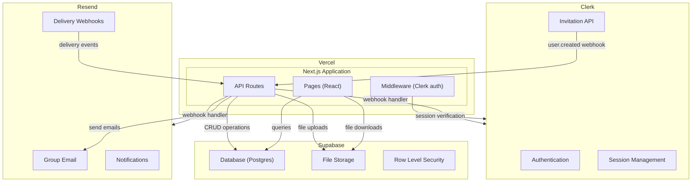

# NSI Community Portal — System Design Document

**Date:** 2026-04-04
**Author:** Spencer Campbell
**Status:** Pre-build

> **Companion documents:** ADRs 001–005 (technical decisions), `nsi-portal-project-status.md` (evaluation history and requirements), `nsi-portal-design-spec.md` (detailed UI/UX specification and data model).

---

## 1. Architecture Overview

The NSI Community Portal is a members-only web application for a 14-property strata community in British Columbia (~70–112 members). It provides three core features: a browsable document library, a self-service member directory, and group email.

### Service Map



### Service Responsibilities

| Service | Owns | Does Not Own |
|---------|------|-------------|
| **Clerk** | User identity (email, password hash, sessions), invitation emails, password reset emails, optional 2FA, optional social SSO | Roles, capabilities, groups, profile data, authorization |
| **Supabase** | Profile data, roles and capabilities, groups, documents metadata, community board posts, email logs, file storage | Authentication, session management, invitation flow |
| **Resend** | Group email delivery, community board notification delivery, delivery event tracking | Email composition UI, recipient resolution, email scheduling |
| **Vercel** | Application hosting, edge middleware, serverless functions, CI/CD | Data persistence, file storage, email delivery |

### Integration Boundaries

The system has three external integration points, each kept intentionally thin:

1. **Clerk → Supabase (webhook):** When a member accepts an invitation and creates their account, Clerk fires a `user.created` webhook. The application matches the Clerk user to an existing pre-seeded Supabase profile by email and links them.

2. **Supabase → Resend (server action):** When Allison sends a group email, a server action resolves group membership from Supabase, then sends the email via Resend's batch API. Delivery events flow back via Resend webhooks to update the email log.

3. **Clerk → Next.js (middleware):** Every request passes through `clerkMiddleware()`, which verifies the session token. The application then checks the user's capabilities against Supabase data to authorize specific actions.

---

## 2. Authentication & Authorization

### Authentication (Clerk)

Clerk handles identity verification. The application never sees or stores passwords.

**Login flow:**
1. User navigates to `/sign-in`
2. `<SignIn />` component renders (themed to match portal branding via `appearance` prop)
3. User enters email and password
4. Clerk verifies credentials, creates a session, sets a cookie
5. `clerkMiddleware()` verifies the session on subsequent requests
6. Application reads the Clerk user ID from the session and looks up the corresponding Supabase profile

**Invitation flow (detailed in the Onboarding Flow Design document):**
1. Admin creates a member profile in Supabase (pre-seeded with name, lot number, role, groups)
2. Application calls `clerkClient.invitations.createInvitation()` with the member's email
3. Clerk sends the invitation email with a link to `/sign-up?__clerk_ticket=...`
4. Member clicks link, sets password, account activates
5. Clerk `user.created` webhook fires → application links Clerk user to existing Supabase profile

### Authorization (Supabase + Application)

Authorization is entirely application-owned. Clerk plays no role in determining what a user can do.

**Capability system:**

```
User → has one Role → Role has many Capabilities
```

Capabilities are discrete permission strings:

| Capability | Grants |
|-----------|--------|
| `documents.read` | Browse and download documents |
| `documents.write` | Upload, rename, delete documents and folders |
| `directory.read` | View member directory |
| `directory.manage` | Edit other members' profiles |
| `email.send` | Compose and send group emails |
| `community.read` | View community board |
| `community.write` | Create posts and comments |
| `community.moderate` | Pin/unpin, delete others' posts |
| `admin.access` | Access the admin section |
| `groups.manage` | Create/edit/delete groups, manage membership |
| `roles.manage` | Create/edit roles, assign capabilities |

**MVP seed roles:**

| Role | Capabilities |
|------|-------------|
| Admin | All capabilities |
| Council | `documents.read`, `directory.read`, `email.send`, `community.*` |
| Member | `documents.read`, `directory.read`, `community.read`, `community.write` |

Roles are admin-configurable — Allison can create new roles and assign capabilities through the admin UI.

**Enforcement layers:**

1. **Middleware:** `clerkMiddleware()` verifies the user is authenticated. For admin routes, the middleware also checks for `admin.access` capability by querying the user's role.
2. **Server actions / API routes:** Every mutation checks the user's capabilities before executing. This is the security boundary.
3. **Client-side rendering:** React components conditionally render admin controls based on capabilities. This is a UX convenience, not a security measure.
4. **Row Level Security:** Supabase RLS policies provide defense-in-depth at the database level.

---

## 3. Data Model

All application data lives in Supabase (PostgreSQL). Clerk owns only identity data (email, password hash, session tokens).

```
User
  id                uuid, PK
  clerk_id          text, unique, nullable    -- set when invitation is accepted
  email             text, unique, not null
  first_name        text, not null
  last_name         text, not null
  phone             text
  lot_number        text
  role_id           uuid, FK → Role
  invited_at        timestamptz
  accepted_at       timestamptz               -- null until invitation accepted
  last_login        timestamptz
  notify_new_post   boolean, default true
  notify_replies    boolean, default true
  active            boolean, default true
  created_at        timestamptz
  updated_at        timestamptz

Role
  id                uuid, PK
  name              text, unique, not null
  description       text
  is_default        boolean, default false    -- assigned to new members on invite
  created_at        timestamptz

RoleCapability
  role_id           uuid, FK → Role
  capability        text, not null
  -- PK: (role_id, capability)

Group
  id                uuid, PK
  name              text, unique, not null
  slug              text, unique, not null
  description       text
  created_at        timestamptz

UserGroup
  user_id           uuid, FK → User
  group_id          uuid, FK → Group
  -- PK: (user_id, group_id)

CustomField
  id                uuid, PK
  name              text, not null
  field_type        text, not null            -- 'text', 'number', 'date', 'single_select'
  options           jsonb                     -- for single_select type
  show_in_directory boolean, default true
  sort_order        integer
  created_at        timestamptz

CustomFieldValue
  user_id           uuid, FK → User
  field_id          uuid, FK → CustomField
  value             text
  visible           boolean, default true     -- member opt-in for directory visibility
  -- PK: (user_id, field_id)

Folder
  id                uuid, PK
  name              text, not null
  slug              text, not null
  parent_id         uuid, FK → Folder, nullable
  sort_order        integer
  created_by        uuid, FK → User
  created_at        timestamptz

Document
  id                uuid, PK
  display_name      text, not null
  storage_path      text, not null            -- key in Supabase Storage
  folder_id         uuid, FK → Folder
  file_size          bigint
  mime_type         text
  uploaded_by       uuid, FK → User
  uploaded_at       timestamptz

Post
  id                uuid, PK
  title             text, not null
  body              text, not null
  author_id         uuid, FK → User
  pinned            boolean, default false
  created_at        timestamptz
  updated_at        timestamptz

Comment
  id                uuid, PK
  body              text, not null
  post_id           uuid, FK → Post
  author_id         uuid, FK → User
  created_at        timestamptz

EmailLog
  id                uuid, PK
  subject           text, not null
  body              text, not null
  sent_by           uuid, FK → User
  target_groups     text[]                    -- group slugs, or ['all']
  recipient_count   integer
  resend_batch_id   text                      -- for tracking delivery
  sent_at           timestamptz
```

### Key Relationships

- A **User** belongs to one **Role** and many **Groups**
- A **Role** has many **Capabilities** (via RoleCapability join table)
- A **Folder** can have a parent **Folder** (two-level nesting)
- A **Document** belongs to one **Folder** and links to a file in Supabase Storage
- A **Post** has many **Comments**; both are authored by a **User**
- **CustomFieldValues** link **Users** to **CustomFields** with per-user visibility toggles

---

## 4. Route Structure

### Public Routes (no auth required)

```
/sign-in          -- Clerk <SignIn /> component
/sign-up          -- Clerk <SignUp /> component (invitation acceptance)
```

### Protected Routes (authenticated members)

```
/                 -- Dashboard (landing page, pinned posts, quick links)
/documents        -- Document library (browsable folder tree)
/documents/:slug  -- Folder contents
/directory        -- Member directory (searchable table)
/community        -- Community board (post feed)
/community/:id    -- Single post with comments
/profile          -- Edit own profile, notification preferences
```

### Capability-Gated Routes

```
/email/compose    -- Group email composer (requires email.send)
/email/history    -- Sent email log (requires email.send)
/admin            -- Admin section root (requires admin.access)
/admin/members    -- Member management table
/admin/groups     -- Group CRUD
/admin/roles      -- Role and capability management
```

### API Routes / Server Actions

```
POST /api/webhooks/clerk     -- Clerk user.created webhook handler
POST /api/webhooks/resend    -- Resend delivery event webhook handler

-- Server actions (called from client components):
inviteMember(email, name, lotNumber, roleId, groupIds)
resendInvitation(userId)
revokeInvitation(userId)
uploadDocument(folderId, file)
deleteDocument(documentId)
createFolder(name, parentId)
sendGroupEmail(subject, body, groupSlugs)
createPost(title, body)
createComment(postId, body)
pinPost(postId)
deletePost(postId)
updateProfile(fields)
updateRole(roleId, capabilities)
```

---

## 5. Frontend Architecture

### Framework

Next.js with App Router, React Server Components, and Server Actions. Tailwind CSS for styling. No component library — custom components for the portal's specific needs.

### Layout Structure

```
app/
├── layout.tsx                -- Root layout: ClerkProvider, Supabase client, global styles
├── (auth)/
│   ├── sign-in/[[...sign-in]]/page.tsx
│   └── sign-up/[[...sign-up]]/page.tsx
├── (portal)/
│   ├── layout.tsx            -- Portal layout: nav bar, auth guard
│   ├── page.tsx              -- Dashboard
│   ├── documents/
│   │   ├── page.tsx          -- Folder tree
│   │   └── [slug]/page.tsx   -- Folder contents
│   ├── directory/page.tsx
│   ├── community/
│   │   ├── page.tsx          -- Post feed
│   │   └── [id]/page.tsx     -- Single post
│   ├── profile/page.tsx
│   ├── email/
│   │   ├── compose/page.tsx  -- (capability-gated)
│   │   └── history/page.tsx  -- (capability-gated)
│   └── admin/
│       ├── layout.tsx        -- Admin layout (capability-gated)
│       ├── members/page.tsx
│       ├── groups/page.tsx
│       └── roles/page.tsx
```

### Component Patterns

- **Server Components by default.** Data fetching happens on the server. Pages are Server Components that fetch data from Supabase and render.
- **Client Components for interactivity.** Forms, modals, dropdowns, search filters, and any component that needs `useState` or event handlers.
- **Capability checks in Server Components.** The portal layout fetches the current user's capabilities and passes them via context. Client components read from context to show/hide admin controls.
- **Optimistic updates for mutations.** Post creation, comment submission, and profile updates use optimistic UI patterns for responsiveness, with server-side validation.

### Navigation

Top navigation bar with five primary items plus an avatar menu:

```
Home · Documents · Directory · Community · [Send Email*] · [Admin*] · [Avatar]
                                            (* capability-gated)
```

Mobile: hamburger menu with slide-out drawer from the right.

---

## 6. Key Data Flows

### 6.1 Member Invitation

```
Allison (Admin UI)
  │
  ├─ 1. Fills in member form (name, email, lot, role, groups)
  │
  ├─ 2. Server action: create User record in Supabase
  │     (invited_at = now, accepted_at = null, clerk_id = null)
  │
  ├─ 3. Server action: clerkClient.invitations.createInvitation()
  │     (email, redirectUrl → /sign-up)
  │
  └─ 4. Clerk sends invitation email
       │
       Member clicks link
       │
       ├─ 5. Lands on /sign-up with __clerk_ticket param
       ├─ 6. Sets password, submits
       ├─ 7. Clerk creates user, fires user.created webhook
       │
       └─ 8. Webhook handler:
            ├─ Match Clerk user to Supabase profile by email
            ├─ Set clerk_id on User record
            └─ Set accepted_at = now
```

### 6.2 Document Upload

```
Admin (Document Library)
  │
  ├─ 1. Navigates to folder, clicks upload
  ├─ 2. Selects file(s) via picker or drag-and-drop
  │
  ├─ 3. Client: supabase.storage.from('documents').upload(uuid.pdf, file)
  │     → file stored in Supabase Storage bucket
  │
  ├─ 4. Server action: create Document record in Supabase
  │     (storage_path, display_name, folder_id, file_size, mime_type)
  │
  └─ 5. UI updates to show new document in folder
```

### 6.3 Document Download

```
Member (Document Library)
  │
  ├─ 1. Clicks document name
  │
  ├─ 2. Server action: supabase.storage.from('documents').createSignedUrl()
  │     → returns time-limited URL (e.g., 60 seconds)
  │
  └─ 3. Browser downloads file via signed URL
       (URL expires, preventing unauthorized sharing)
```

### 6.4 Group Email Send

```
Allison (Email Compose)
  │
  ├─ 1. Selects group(s), writes subject + body
  ├─ 2. Confirmation dialog: "Send to Work Party (23 members)?"
  │
  ├─ 3. Server action:
  │     ├─ Resolve group membership → list of email addresses
  │     ├─ Render React Email template with body content
  │     ├─ Send via Resend batch API (100 per call)
  │     └─ Create EmailLog record in Supabase
  │
  └─ 4. Resend webhooks → delivery events logged against EmailLog
```

### 6.5 Community Board Post + Notification

```
Member (Community Board)
  │
  ├─ 1. Clicks "New Post", writes title + body, submits
  │
  ├─ 2. Server action: create Post record in Supabase
  │
  ├─ 3. Background: query all users with notify_new_post = true
  │     (excluding the author)
  │
  ├─ 4. Send notification emails via Resend
  │     (React Email template with post preview + link)
  │
  └─ 5. Post appears in feed immediately (optimistic update)
```

---

## 7. Security Model

### Defense in Depth

Security is enforced at four layers, each independently preventing unauthorized access:

| Layer | Mechanism | What It Prevents |
|-------|-----------|-----------------|
| **Edge** | Clerk middleware | Unauthenticated access to protected routes |
| **Application** | Capability checks in server actions | Unauthorized mutations (e.g., member without `email.send` trying to send email) |
| **Database** | Row Level Security policies | Direct data access bypassing the application layer |
| **Storage** | Private bucket + signed URLs | Unauthorized file downloads via URL guessing |

### Clerk Session Verification

Every request to a protected route passes through `clerkMiddleware()`. The middleware:

1. Checks for a valid Clerk session cookie
2. If absent or expired, redirects to `/sign-in`
3. If valid, attaches the Clerk user ID to the request context

### Capability Enforcement

Server actions and API routes follow a consistent pattern:

```typescript
async function sendGroupEmail(subject: string, body: string, groups: string[]) {
  const user = await getCurrentUser()       // Get Clerk user → Supabase profile
  const capabilities = await getUserCapabilities(user.role_id)

  if (!capabilities.includes('email.send')) {
    throw new Error('Unauthorized')
  }

  // ... proceed with sending
}
```

### Row Level Security

RLS policies on key tables:

- **User:** Authenticated users can read all profiles (directory). Users can update only their own profile.
- **Document / Folder:** Authenticated users can read. Only users with `documents.write` capability can insert/update/delete.
- **Post / Comment:** Authenticated users can read. Users can insert their own posts/comments. Only users with `community.moderate` can delete others' posts.
- **Role / RoleCapability:** Only users with `roles.manage` can modify.

---

## 8. Infrastructure & Deployment

### Hosting

Vercel (free tier for development, Pro if needed for production). The application deploys as a Next.js application with:

- **Edge middleware** for auth checks (runs at the edge, low latency)
- **Serverless functions** for API routes and server actions
- **Static assets** for the frontend build

### Environment Management

Two environments:

| Environment | Clerk | Supabase | Resend | Purpose |
|------------|-------|----------|--------|---------|
| **Development** | Dev instance | Free tier project | Free tier (test mode) | Local dev + preview deployments |
| **Production** | Prod instance | Pro plan ($25/month) | Free tier (production) | Live site for community |

Environment variables:
- `NEXT_PUBLIC_CLERK_PUBLISHABLE_KEY`
- `CLERK_SECRET_KEY`
- `CLERK_WEBHOOK_SECRET`
- `NEXT_PUBLIC_SUPABASE_URL`
- `NEXT_PUBLIC_SUPABASE_PUBLISHABLE_DEFAULT_KEY`
- `SUPABASE_SECRET_KEY`
- `RESEND_API_KEY`
- `RESEND_WEBHOOK_SECRET`

### CI/CD

Vercel's GitHub integration provides:
- **Preview deployments** on every pull request
- **Production deployments** on merge to `main`
- **Environment variable management** via Vercel dashboard

### Domain

A custom domain (TBD) pointed at Vercel. Email sending domain configured with SPF, DKIM, and DMARC records for Resend deliverability.

---

## 9. Cost Summary

| Service | Development | Production | Notes |
|---------|------------|------------|-------|
| Clerk | $0 (free tier) | $0 (free tier) | 10,000 MAU limit; NSI needs ~112 |
| Supabase | $0 (free tier) | $25 USD/month | Pro plan eliminates project pausing |
| Resend | $0 (free tier) | $0 (free tier) | 3,000 emails/month; NSI needs ~500–1,500 |
| Vercel | $0 (free tier) | $0 (free tier) | Hobby plan sufficient for NSI's traffic |
| Domain | — | ~$15 CAD/year | .ca or similar |
| **Total** | **$0/month** | **~$25 USD/month (~$300 CAD/year)** | Well under $500–945 CAD/year budget |

---

## 10. Open Questions

1. **Domain name:** Needs to be short, memorable, and available. Affects email sending domain configuration.
2. **Rich text editor:** Tiptap vs. another editor for email compose and community board posts. Needs to produce clean HTML for email rendering.
3. **Community board categories:** Pre-defined categories (Announcement, Ride Request, General) or no categorization initially?
4. **Notification batching:** Immediate email per community board event, or daily digest? Immediate is simpler; digest prevents notification fatigue if the board gets active.
5. **Hosting tier:** Vercel's free tier may be sufficient even for production given NSI's traffic. Monitor and upgrade if needed.
